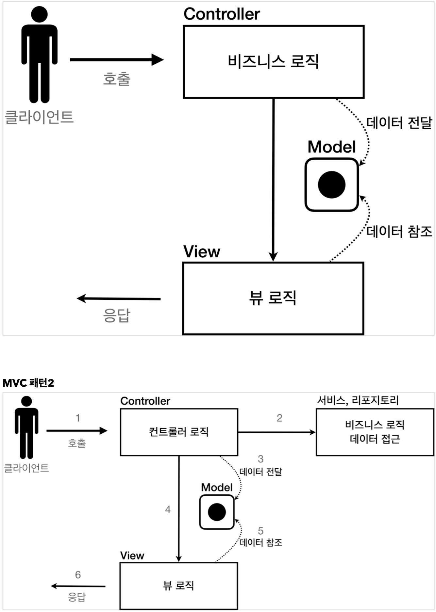
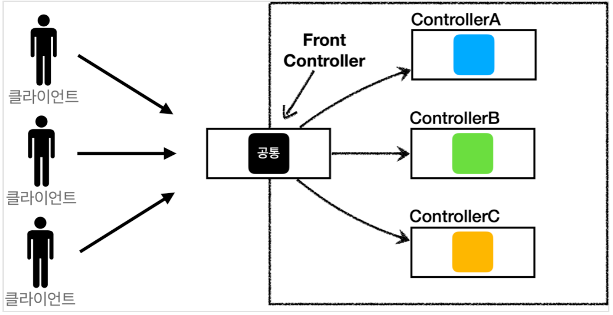
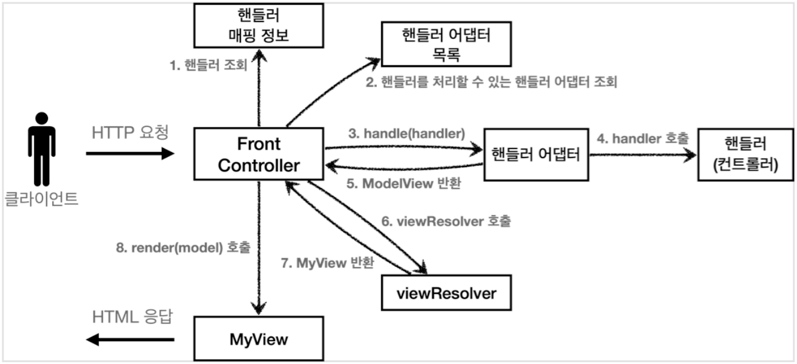
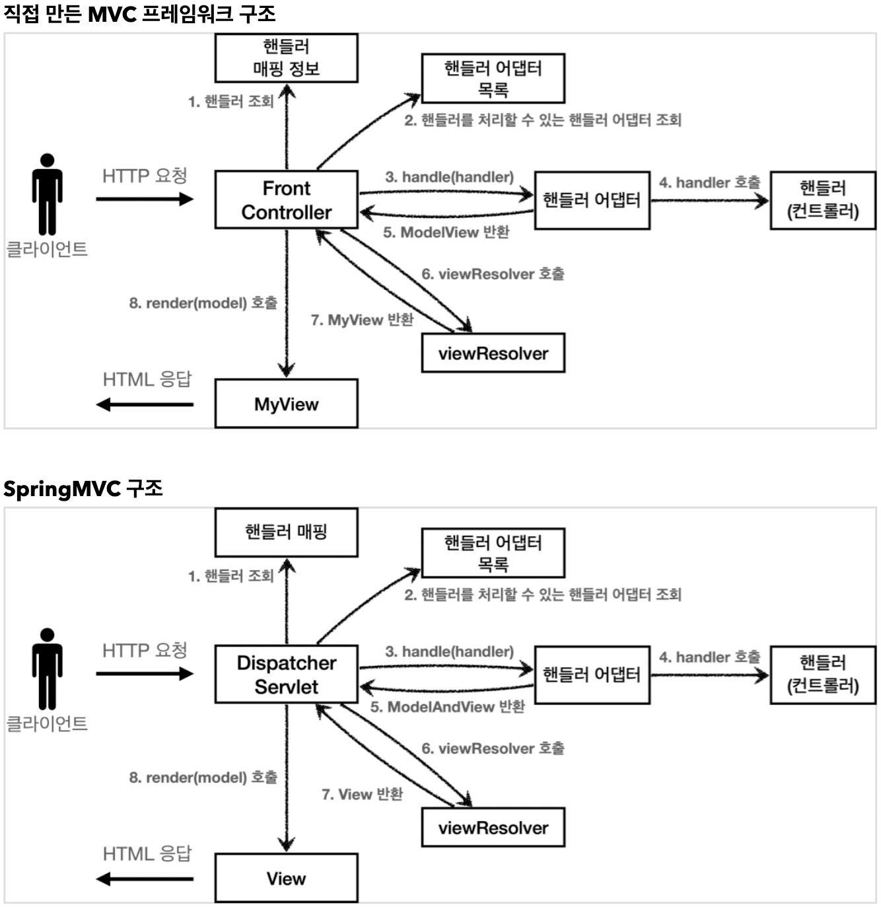
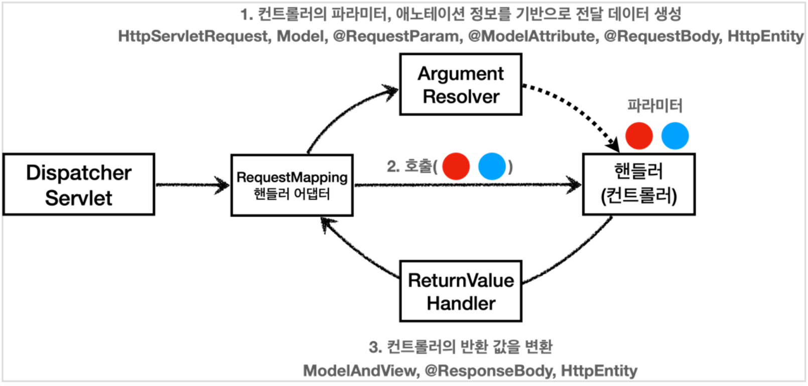

# 김영한님 스프링 MVC 스터디

### 관련 저장소

- [서블릿](https://github.com/give928/study-spring-servlet)
- [타임리프](https://github.com/give928/study-spring-mvc-thymeleaf)
- [아이템 서비스](https://github.com/give928/study-spring-mvc-item-service)
- [메시지, 국제화](https://github.com/give928/study-spring-mvc-message)
- [검증](https://github.com/give928/study-spring-mvc-validation)
- [로그인, 필터, 스프링 인터셉터](https://github.com/give928/study-spring-mvc-login)
- [예외 처리와 오류 페이지](https://github.com/give928/study-spring-mvc-exception)
- [스프링 타입 컨버터](https://github.com/give928/study-spring-mvc-typeconverter)
- [파일 업로드](https://github.com/give928/study-spring-mvc-upload)

### ****웹 서버, 웹 애플리케이션 서버(WAS)****

- 웹 서버는 정적 리소스(파일), WAS는 애플리케이션 로직
- 자바는 서블릿 컨테이너 기능을 제공하면 WAS
- 서블릿 없이 자바코드를 실행하는 서버 프레임워크도 있음
  WAS는 애플리케이션 코드를 실행하는데 더 특화

### 서블릿

- WAS 작동
    - 서버 TCP/IP 대기, 소켓 연결
    - HTTP 요청 메시지 파싱
    - HTTP Method, URL 인지
    - Content-Type 확인
    - HTTP 메시지 바디 내용 파싱
        - 파라미터
    - 저장 프로세스 실행
    - 비지니스 로직 실행
        - 데이터베이스 저장 요청
    - HTTP 응답 메시지 생성
        - HTTP 시작 라인 생성
        - Header 생성
        - 메시지 바디에 HTML 생성해서 입력
    - TCP/IP 응답 전달, 소켓 종료
- HTTP 요청
    - WAS는 Request, Response 객체를 새로 만들어서 서블릿 객체 호출
    - 개발자는 Request 객체에서 HTTP 요청 정보를 편리하게 꺼내서 사용
    - 개발자는 Response 객체에 HTTP 응답 정보를 편리하게 입력
    - WAS는 Response 객체에 담겨있는 내용으로 HTTP 응답 정보를 생성
- 서블릿 컨테이너
    - 톰캣처럼 서블릿을 지원하는 WAS를 서블릿 컨테이너라고 함
    - 서블릿 컨테이너는 서블릿 객체를 생성, 초기화, 호출, 종료하는 생명주기 관리
    - 서블릿 객체는 **싱글톤으로 관리**
        - 고객의 요청이 올 때 마다 계속 객체를 생성하는 것은 비효율
        - 최초 로딩 시점에 서블릿 객체를 미리 만들어두고 재활용
        - 모든 고객 요청은 동일한 서블릿 객체 인스턴스에 접근
        - **공유 변수 사용 주의**
        - 서블릿 컨테이너 종료시 함께 종료
    - JSP도 서블릿으로 변환 되어서 사용
    - 동시 요청을 위한 멀티 스레드 처리 지원

### 동시요청 - 멀티 스레드

- 동시 요청을 처리할 수 있다.
- 리소스(CPU, 메모리)가 허용할 때 까지 처리가능
- 하나의 쓰레드가 지연 되어도, 나머지 쓰레드는 정상 동작한다.
- 쓰레드는 생성 비용은 매우 비싸다.
- 쓰레드는 컨텍스트 스위칭 비용이 발생한다.
- 쓰레드 생성에 제한이 없다. 고객 요청이 너무 많이 오면, CPU, 메모리 임계점을 넘어서 서버가 죽을 수 있다.
- 필요한 쓰레드를 쓰레드 풀에 보관하고 관리한다.
- 쓰레드 풀에 생성 가능한 쓰레드의 최대치를 관리한다. 톰캣은 최대 200개 기본 설정 (변경 가능)
- 쓰레드가 미리 생성되어 있으므로, 쓰레드를 생성하고 종료하는 비용(CPU)이 절약되고, 응답 시간이 빠르다.
- 생성 가능한 쓰레드의 최대치가 있으므로 너무 많은 요청이 들어와도 기존 요청은 안전하게 처리할 수 있다.
- was의 주요 튜닝 포인트는 최대 스레드(max thread) 수
    - 성능 테스트로 적정 숫자 찾아야 한다.
    - 아파치 ab, 제이미터, nGrinder
- 멀티 쓰레드에 대한 부분은 WAS가 처리
- **개발자가 멀티 쓰레드 관련 코드를 신경쓰지 않아도 됨**
- 개발자는 마치 **싱글 쓰레드 프로그래밍을 하듯이 편리하게 소스 코드를 개발**
- 멀티 쓰레드 환경이므로 싱글톤 객체(서블릿, 스프링 빈)는 주의해서 사용

### HTML, HTTP API, CSR, SSR

HTTP API

- HTML이 아니라 데이터 전달
- 주로 JSON 형식 사용
- 다양한 시스템에서 호출. 앱, 웹 클라이언트, 서버 to 서버

CSR

- Client Side Rendering
- HTML 결과를 자바스크립트를 사용해 웹 브라우저에서 동적으로 생성해서 적용
- 주로 동적인 화면에 사용, 웹 환경을 마치 앱 처럼 필요한 부분부분 변경할 수 있음
- 관련기술: React, Vue.js -> 웹 프론트엔드 개발자

SSR

- Server Side Rendering
- HTML 최종 결과를 서버에서 만들어서 웹 브라우저에 전달
- 주로 정적인 화면에 사용
- 관련기술: JSP, 타임리프 **> 백엔드 개발자**

React, Vue.js를 CSR + SSR 동시에 지원하는 웹 프레임워크도 있음
SSR을 사용하더라도, 자바스크립트를 사용해서 화면 일부를 동적으로 변경 가능

### 자바 벡엔드 웹 기술 역사

- 서블릿
- JSP
- 서블릿, JSP 조합 MVC 패턴 사용
- MVC 프레임워크 춘추전국 시대 - 2000년 초 ~ 2010년 초
    - MVC 패턴 자동화
    - 스트럿츠, 웹워크, 스프링 MVC(과거 버전)
- 애너테이션 기반 스프링 MVC 등장
    - @Controller
- 스프링 부트의 등장
    - Jar로 빌드 → 빌드 배포 단순화
- 스프링 웹 기술의 분화
    - Web Servlet - Spring MVC
    - Web Reactive - Spring WebFlux
        - **특징**
            - 비동기 넌 블러킹 처리
            - 최소 쓰레드로 최대 성능(CPU 코어 수와 비슷하게 스레드 수 설정) - 쓰레드 컨텍스트 스위칭 비용 효율화
            - 함수형 스타일로 개발 - 동시처리 코드 효율화
            - 서블릿 기술 사용X- netty
        - **그런데**
            - 웹 플럭스는 기술적 난이도 매우 높음
            - 아직은 RDB 지원 부족
            - 일반 MVC의 쓰레드 모델도 충분히 빠르다.
            - 실무에서 아직 많이 사용하지는 않음 (전체 1% 이하)
- 자바 뷰 템플릿
    - JSP
        - 속도 느림, 기능 부족
    - 프리마커(Freemarker), Velocity(벨로시티)
        - 속도 문제 해결, 다양한 기능
    - 타임리프(Thymeleaf)
        - 내추럴 템플릿: HTML의 모양을 유지하면서 뷰 템플릿 적용 가능
        - 스프링 MVC와 강력한 기능 통합
        - **최선의 선택**, 단 성능은 프리마커, 벨로시티가 더 빠름

### 서블릿

```java
@ServletComponentScan // 서블릿 자동 등록
@SpringBootApplication
public class SpringServletApplication {
	public static void main(String[] args) {
		SpringApplication.run(SpringServletApplication.class, args);
	}
}
```

```java
@WebServlet(name = "helloServlet", urlPatterns = "/hello")
public class HelloServlet extends HttpServlet {
    @Override
    protected void service(HttpServletRequest request, HttpServletResponse response) throws ServletException, IOException {
    }
}
```

### MVC 패턴



**FrontController 패턴 특징**

- 프론트 컨트롤러 서블릿 하나로 클라이언트의 요청을 받음
- 프론트 컨트롤러가 요청에 맞는 컨트롤러를 찾아서 호출
- 입구를 하나로!
- 공통 처리 가능
- 프론트 컨트롤러를 제외한 나머지 컨트롤러는 서블릿을 사용하지 않아도 됨



**스프링 웹 MVC와 프론트 컨트롤러**

스프링 웹 MVC의 핵심도 바로 **FrontController**

스프링 웹 MVC의 **DispatcherServlet**이 FrontController 패턴으로 구현되어 있음

**어댑터 패턴**

- **핸들러 어댑터**: 중간에 어댑터 역할을 하는 어댑터가 추가되었는데 이름이 핸들러 어댑터이다. 여기서
  어댑터 역할을 해주는 덕분에 다양한 종류의 컨트롤러를 호출할 수 있다.
- **핸들러**: 컨트롤러의 이름을 더 넓은 범위인 핸들러로 변경했다. 그 이유는 이제 어댑터가 있기 때문에 꼭
  컨트롤러의 개념 뿐만 아니라 어떠한 것이든 해당하는 종류의 어댑터만 있으면 다 처리할 수 있기 때문이다.



**컨트롤러(Controller) → 핸들러(Handler)**

이전에는 컨트롤러를 직접 매핑해서 사용했다. 그런데 이제는 어댑터를 사용하기 때문에, 컨트롤러 뿐만 아니라 어댑터가 지원하기만 하면, 어떤 것이라도 URL에 매핑해서 사용할 수 있다. 그래서 이름을 컨트롤러에서 더 넒은 범위의 핸들러로 변경했다.



### **DispatcherServlet**

프론트 컨트롤러 패턴

DispacherServlet 도 부모 클래스에서 HttpServlet 을 상속 받아서 사용하고, 서블릿으로 동작

스프링 부트는 DispacherServlet 을 서블릿으로 자동으로 등록하면서 **모든 경로**( urlPatterns="/" )에 대해서 매핑한다.

- 스프링 MVC의 큰 강점은 DispatcherServlet 코드의 변경 없이, 원하는 기능을 변경하거나 확장할 수
  있다는 점이다. 지금까지 설명한 대부분을 확장 가능할 수 있게 인터페이스로 제공한다.
- 이 인터페이스들만 구현해서 DispatcherServlet 에 등록하면 여러분만의 컨트롤러를 만들 수도 있다.

**주요 인터페이스 목록**

- 핸들러 매핑: org.springframework.web.servlet.HandlerMapping
- 핸들러 어댑터: org.springframework.web.servlet.HandlerAdapter
- 뷰 리졸버: org.springframework.web.servlet.ViewResolver
- 뷰: org.springframework.web.servlet.View

**HandlerMapping(핸들러 매핑)**

- 핸들러 매핑에서 이 컨트롤러를 찾을 수 있어야 한다.
- 예) **스프링 빈의 이름으로 핸들러를 찾을 수 있는 핸들러 매핑**이 필요하다.
- 0 = RequestMappingHandlerMapping : 애노테이션 기반의 컨트롤러인 @RequestMapping에서 사용
- 1 = BeanNameUrlHandlerMapping : 스프링 빈의 이름으로 핸들러를 찾는다.

**HandlerAdapter(핸들러 어댑터)**

- 핸들러 매핑을 통해서 찾은 핸들러를 실행할 수 있는 핸들러 어댑터가 필요하다.
- 예) Controller 인터페이스를 실행할 수 있는 핸들러 어댑터를 찾고 실행해야 한다.
- 0 = RequestMappingHandlerAdapter : 애노테이션 기반의 컨트롤러인 @RequestMapping에서 사용
- 1 = HttpRequestHandlerAdapter : HttpRequestHandler 처리
- 2 = SimpleControllerHandlerAdapter : Controller 인터페이스(애노테이션X, 과거에 사용) 처리

### 스프링 MVC

스프링이 제공하는 컨트롤러는 애노테이션 기반으로 동작해서, 매우 유연하고 실용적이다. 과거에는 자바 언어에 애노테이션이 없기도 했고, 스프링도 처음부터 이런 유연한 컨트롤러를 제공한 것은 아니다.

**@RequestMapping**

스프링은 애노테이션을 활용한 매우 유연하고, 실용적인 컨트롤러를 만들었는데 이것이 바로 @RequestMapping 애노테이션을 사용하는 컨트롤러이다.

RequestMappingHandlerMapping 은 스프링 빈 중에서 @RequestMapping 또는 @Controller 가
클래스 레벨에 붙어 있는 경우에 매핑 정보로 인식한다

@PathVariable

```java
// 파라미터로 추가 매핑 - 특정 파라미터가 있거나 없는 조건을 추가할 수 있다. 잘 사용하지는 않는다.
@GetMapping*(*value = "/mapping-param", params = "mode=debug"*)

// 특정 헤더로 추가 매핑
@GetMapping(value = "/mapping-header", headers = "mode=debug")

// Content-Type 헤더 기반 추가 매핑 Media Type * consumes="application/json"
@PostMapping(value = "/mapping-consume", consumes = "application/json")

// Accept 헤더 기반 Media Type * produces = "text/html"
@PostMapping(value = "/mapping-produce", produces = "text/html")*
```

**요청 매핑 - API 예시**

회원 관리를 HTTP API로 만든다 생각하고 매핑을 어떻게 하는지 알아보자.(실제 데이터가 넘어가는 부분은 생략하고 URL 매핑만)

**API**

- 목록 조회: GET /members
- 등록: POST /members
- 조회: GET /members/{id}
- 수정: PATCH /members/{id}
- 삭제: DELETE /members/{id}

@Conroller 의 사용 가능한 파라미터 목록은 다음 공식 메뉴얼에서 확인할 수 있다.

[https://docs.spring.io/spring-framework/docs/current/reference/html/web.html#mvc-ann-arguments](https://docs.spring.io/spring-framework/docs/current/reference/html/web.html#mvc-ann-arguments)

@Conroller 의 사용 가능한 응답 값 목록은 다음 공식 메뉴얼에서 확인할 수 있다.

[https://docs.spring.io/spring-framework/docs/current/reference/html/web.html#mvc-ann-return-types](https://docs.spring.io/spring-framework/docs/current/reference/html/web.html#mvc-ann-return-types)

### 요청 파라미터 - query, HTML Form 파라미터

@PathVariable

@RequestParam

```java
@RequestParam("username") String memberName
@RequestParam String username
String username // 생략 가능
@RequestParam(required = true, defaultValue = "guest") String username
@RequestParam(required = false) Integer age
@RequestParam(required = false, defaultValue = "-1") int age
@RequestParam Map<String, Object> paramMap
@RequestParam MultiValueMap<String, Object> paramMap
```

@ModelAttribute // 생략 가능

### HTTP 메시지 바디

```java
public void requestBodyString(HttpServletRequest request, HttpServletResponse response) throws IOException {
    ServletInputStream inputStream = request.getInputStream();
    String messageBody = StreamUtils.copyToString(inputStream, StandardCharsets.UTF_8);
    log.info("RequestBodyStringController.requestBodyString messageBody={}", messageBody);

    response.getWriter().write("ok");
}

public void requestBodyStringV2(InputStream inputStream, Writer responseWriter) throws IOException {
    String messageBody = StreamUtils.copyToString(inputStream, StandardCharsets.UTF_8);
    log.info("RequestBodyStringController.requestBodyStringV2 messageBody={}", messageBody);
    responseWriter.write("ok");
}

public HttpEntity<String> requestBodyStringV3(HttpEntity<String> httpEntity) {
    String messageBody = httpEntity.getBody();
    log.info("RequestBodyStringController.requestBodyStringV3 messageBody={}", messageBody);
    return new HttpEntity<>("ok");
}
```

HttpEntity

- RequestEntity
    - HttpMethod, url 정보가 추가, 요청에서 사용
- ResponseEntity
    - HTTP 상태 코드 설정 가능, 응답에서 사용
    - return new ResponseEntity<String>("Hello World", responseHeaders, HttpStatus.CREATED

@RequestBody

### **HTTP 요청 메시지 - JSON**

```java
@PostMapping("/request-body-json-v1")
public void requestBodyJsonV1(HttpServletRequest request, HttpServletResponse response) throws IOException {
    ServletInputStream inputStream = request.getInputStream();
    String messageBody = StreamUtils.copyToString(inputStream, StandardCharsets.UTF_8);
    HelloData data = objectMapper.readValue(messageBody, HelloData.class);
    log.info("username={}, age={}", data.getUsername(), data.getAge());

    response.getWriter().write("ok");
}
/**
 * @RequestBody
 * HttpMessageConverter 사용 -> StringHttpMessageConverter 적용
 * @ResponseBody
 * - 모든 메서드에 @ResponseBody 적용
 * - 메시지 바디 정보 직접 반환(view 조회X)
 * - HttpMessageConverter 사용 -> StringHttpMessageConverter 적용
 */
@ResponseBody
@PostMapping("/request-body-json-v2")
public String requestBodyJsonV2(@RequestBody String messageBody) throws IOException {
    HelloData data = objectMapper.readValue(messageBody, HelloData.class);
    log.info("username={}, age={}", data.getUsername(), data.getAge());

    return "ok";
}

/**
 * @RequestBody 생략 불가능(@ModelAttribute 가 적용되어 버림)
 * HttpMessageConverter 사용 -> MappingJackson2HttpMessageConverter (content-type: application/json)
 */
@ResponseBody
@PostMapping("/request-body-json-v3")
public String requestBodyJsonV3(@RequestBody HelloData data) {
    log.info("username={}, age={}", data.getUsername(), data.getAge());

    return "ok";
}

/**
 * HttpMessageConverter 사용 -> MappingJackson2HttpMessageConverter (content-type: application/json)
 */
@ResponseBody
@PostMapping("/request-body-json-v4")
public String requestBodyJsonV4(RequestEntity<HelloData> requestEntity) {
    HelloData data = requestEntity.getBody();
    log.info("RequestBodyJsonController.requestBodyJsonV4");
    log.info("username={}, age={}", data.getUsername(), data.getAge());

    return "ok";
}
```

HttpEntity, RequestEntity

@RequestBody

### **HTTP 응답 - 정적 리소스, 뷰 템플릿**

- 정적 리소스
    - 예) 웹 브라우저에 정적인 HTML, css, js을 제공할 때는, **정적 리소스**를 사용한다.
    - /static , /public , /resources , /META-INF/resources
    - src/main/resources 는 리소스를 보관하는 곳이고, 또 클래스패스의 시작 경로
- 뷰 템플릿 사용
    - 예) 웹 브라우저에 동적인 HTML을 제공할 때는 뷰 템플릿을 사용한다.
    - 뷰 템플릿을 거쳐서 HTML이 생성되고, 뷰가 응답을 만들어서 전달한다.
      일반적으로 HTML을 동적으로 생성하는 용도로 사용하지만, 다른 것들도 가능하다. 뷰 템플릿이 만들 수
      있는 것이라면 뭐든지 가능하다.
    - src/main/resources/templates
- HTTP 메시지 사용
    - HTTP API를 제공하는 경우에는 HTML이 아니라 데이터를 전달해야 하므로, HTTP 메시지 바디에
      JSON 같은 형식으로 데이터를 실어 보낸다.

    ```java
    public void responseBodyV1(HttpServletResponse response) throws IOException {
        response.getWriter().write("ok");
    }
    
    @GetMapping("/response-body-string-v2")
    public ResponseEntity<String> responseBodyV2() {
        return new ResponseEntity<>("ok", HttpStatus.OK);
    }
    
    @ResponseBody
    @GetMapping("/response-body-string-v3")
    public String responseBodyV3() {
        return "ok";
    }
    
    @GetMapping("/response-body-json-v1")
    public ResponseEntity<HelloData> responseBodyJsonV1() {
        return new ResponseEntity<>(new HelloData("userA", 20), HttpStatus.OK);
    }
    
    @ResponseStatus(HttpStatus.OK)
    @ResponseBody
    @GetMapping("/response-body-json-v2")
    public HelloData responseBodyJsonV2() {
        return new HelloData("userA", 20);
    }
    ```

  **@RestController**

  @Controller 대신에 @RestController 애노테이션을 사용하면, 해당 컨트롤러에 모두 @ResponseBody 가 적용되는 효과가 있다. 따라서 뷰 템플릿을 사용하는 것이 아니라, HTTP 메시지 바디에 직접 데이터를 입력한다. 이름 그대로 Rest API(HTTP API)를 만들 때 사용하는 컨트롤러이다.

  참고로 @ResponseBody 는 클래스 레벨에 두면 전체에 메서드에 적용되는데, @RestController
  에노테이션 안에 @ResponseBody 가 적용되어 있다.


### **HTTP 메시지 컨버터**

HTTP 메시지 컨버터는 HTTP 요청, HTTP 응답 둘 다 사용된다.

canRead() , canWrite() : 메시지 컨버터가 해당 클래스, 미디어타입을 지원하는지 체크

read() , write() : 메시지 컨버터를 통해서 메시지를 읽고 쓰는 기능

**스프링 MVC는 다음의 경우에 HTTP 메시지 컨버터를 적용한다.**

HTTP 요청: @RequestBody , HttpEntity(RequestEntity) ,

HTTP 응답: @ResponseBody , HttpEntity(ResponseEntity) ,

- ByteArrayHttpMessageConverter : byte[] 데이터를 처리한다.
    - 클래스 타입: byte[] , 미디어타입: */* ,
    - 요청 예) @RequestBody byte[] data
    - 응답 예) @ResponseBody return byte[] 쓰기 미디어타입 application/octet-stream
- StringHttpMessageConverter : String 문자로 데이터를 처리한다.
    - 클래스 타입: String , 미디어타입: */*
    - 요청 예) @RequestBody String data
    - 응답 예) @ResponseBody return "ok" 쓰기 미디어타입 text/plain
- MappingJackson2HttpMessageConverter : application/json
    - 클래스 타입: 객체 또는 HashMap , 미디어타입 application/json 관련
    - 요청 예) @RequestBody HelloData data
    - 응답 예) @ResponseBody return helloData 쓰기 미디어타입 application/json 관련

**HTTP 요청 데이터 읽기**

HTTP 요청이 오고, 컨트롤러에서 @RequestBody , HttpEntity 파라미터를 사용한다.
메시지 컨버터가 메시지를 읽을 수 있는지 확인하기 위해 canRead() 를 호출한다.

대상 클래스 타입을 지원하는가.
예) @RequestBody 의 대상 클래스 ( byte[] , String , HelloData )

HTTP 요청의 Content-Type 미디어 타입을 지원하는가.
예) text/plain , application/json , */*

canRead() 조건을 만족하면 read() 를 호출해서 객체 생성하고, 반환한다.

**HTTP 응답 데이터 생성**

컨트롤러에서 @ResponseBody , HttpEntity 로 값이 반환된다.
메시지 컨버터가 메시지를 쓸 수 있는지 확인하기 위해 canWrite() 를 호출한다.

대상 클래스 타입을 지원하는가.
예) return의 대상 클래스 ( byte[] , String , HelloData )

HTTP 요청의 Accept 미디어 타입을 지원하는가.(더 정확히는 @RequestMapping 의 produces )
예) text/plain , application/json , */*

canWrite() 조건을 만족하면 write() 를 호출해서 HTTP 응답 메시지 바디에 데이터를 생성한다.

### **요청 매핑 헨들러 어뎁터 구조**

**RequestMappingHandlerAdapter 동작 방식**



**ArgumentResolver**

생각해보면, 애노테이션 기반의 컨트롤러는 매우 다양한 파라미터를 사용할 수 있었다.
HttpServletRequest , Model 은 물론이고, @RequestParam , @ModelAttribute 같은 애노테이션 그리고 @RequestBody , HttpEntity 같은 HTTP 메시지를 처리하는 부분까지 매우 큰 유연함을 보여주었다.
이렇게 파라미터를 유연하게 처리할 수 있는 이유가 바로 ArgumentResolver 덕분이다.

애노테이션 기반 컨트롤러를 처리하는 RequestMappingHandlerAdaptor 는 바로 이 ArgumentResolver 를 호출해서 컨트롤러(핸들러)가 필요로 하는 다양한 파라미터의 값(객체)을 생성한다. 그리고 이렇게 파리미터의 값이 모두 준비되면 컨트롤러를 호출하면서 값을 넘겨준다.

스프링은 30개가 넘는 ArgumentResolver 를 기본으로 제공한다.

가능한 파라미터 목록은 다음 공식 메뉴얼에서 확인할 수 있다.

[https://docs.spring.io/spring-framework/docs/current/reference/html/web.html#mvc-ann-arguments](https://docs.spring.io/spring-framework/docs/current/reference/html/web.html#mvc-ann-arguments)

**ReturnValueHandler**

HandlerMethodReturnValueHandler 를 줄여서 ReturnValueHandler 라 부른다.
ArgumentResolver 와 비슷한데, 이것은 응답 값을 변환하고 처리한다.

컨트롤러에서 String으로 뷰 이름을 반환해도, 동작하는 이유가 바로 ReturnValueHandler 덕분이다.

스프링은 10여개가 넘는 ReturnValueHandler 를 지원한다.
예) ModelAndView , @ResponseBody , HttpEntity , String

스프링 MVC는 @RequestBody @ResponseBody 가 있으면
RequestResponseBodyMethodProcessor (ArgumentResolver)
HttpEntity 가 있으면 HttpEntityMethodProcessor (ArgumentResolver)를 사용한다.

**확장**

스프링은 다음을 모두 인터페이스로 제공한다. 따라서 필요하면 언제든지 기능을 확장할 수 있다.

- HandlerMethodArgumentResolver
- HandlerMethodReturnValueHandler
- HttpMessageConverter

스프링이 필요한 대부분의 기능을 제공하기 때문에 실제 기능을 확장할 일이 많지는 않다. 기능 확장은 WebMvcConfigurer 를 상속 받아서 스프링 빈으로 등록하면 된다. 실제 자주 사용하지는 않으니 실제 기능
확장이 필요할 때 WebMvcConfigurer 를 검색해보자.

**WebMvcConfigurer 확장**

```java
public WebMvcConfigurer webMvcConfigurer() {
    return new WebMvcConfigurer() {
        @Override
        public void addArgumentResolvers(List<HandlerMethodArgumentResolver> resolvers) {
            //...
        }
        @Override
        public void extendMessageConverters(List<HttpMessageConverter<?>> converters) {
            //...
        }
    };
}
```

### **PRG Post/Redirect/Get**

- **RedirectAttributes**
    - RedirectAttributes 를 사용하면 URL 인코딩도 해주고, pathVarible , 쿼리 파라미터까지 처리해준다.
    - redirect:/basic/items/{itemId}
      pathVariable 바인딩: {itemId}
      나머지는 쿼리 파라미터로 처리: ?status=true

### Thymeleaf

- 특징
    - 서버 사이드 HTML 렌더링 (SSR)
        - 타임리프는 백엔드 서버에서 HTML을 동적으로 렌더링 하는 용도로 사용된다.
    - 네츄럴 템플릿
        - **순수 HTML을 그대로 유지하면서 뷰 템플릿도 사용할 수 있는 타임리프의 특징을 네츄럴 템플릿** (natural templates)이라 한다.
    - 스프링 통합 지원

**타임리프 사용 선언**

```html
<html xmlns:th="http://www.thymeleaf.org">
```

**기본 표현식**

```html
• 간단한 표현:
	◦ 변수 표현식: ${...}
	◦ 선택 변수 표현식: *{...}
	◦ 메시지 표현식: #{...}
	◦ 링크 URL 표현식: @{...}
	◦ 조각 표현식: ~{...}
• 리터럴
	◦ 텍스트: 'one text', 'Another one!',...
	◦ 숫자: 0, 34, 3.0, 12.3,...
	◦ 불린: true, false
	◦ 널: null
	◦ 리터럴 토큰: one, sometext, main,...
• 문자 연산:
	◦ 문자합치기:+
	◦ 리터럴 대체: |The name is ${name}|
• 산술 연산:
	◦ Binary operators: +, -, *, /, %
	◦ Minus sign (unary operator): -
• 불린 연산:
	◦   Binary operators: and, or
	◦ Boolean negation (unary operator): !, not
• 비교와 동등:
	◦ 비교:>,<,>=,<=(gt,lt,ge,le)
	◦ 동등 연산: ==, != (eq, ne)
• 조건 연산:
	◦   If-then: (if) ? (then)
	◦ If-then-else: (if) ? (then) : (else)
  ◦   Default: (value) ?: (defaultvalue)
• 특별한 토큰:
  ◦   No-Operation: _
```

### 기본 객체들

타임리프는 기본 객체들을 제공한다.

- ${#request}
  ${#response}
  ${#session}
  ${#servletContext}
  ${#locale}

그런데 #request 는 HttpServletRequest 객체가 그대로 제공되기 때문에 데이터를 조회하려면
request.getParameter("data") 처럼 불편하게 접근해야 한다.

HTTP 요청 파라미터 접근: param
예) ${param.paramData}

HTTP 세션 접근: session
예) ${session.sessionData}

스프링 빈 접근: @
예) ${@helloBean.hello('Spring!')}

### **유틸리티 객체와 날짜**

타임리프는 문자, 숫자, 날짜, URI등을 편리하게 다루는 다양한 유틸리티 객체들을 제공한다.

**타임리프 유틸리티 객체들**

#message : 메시지, 국제화 처리
#uris : URI 이스케이프 지원
#dates : java.util.Date 서식 지원
#calendars : java.util.Calendar 서식 지원
#temporals : 자바8 날짜 서식 지원

#numbers : 숫자 서식 지원
#strings : 문자 관련 편의 기능
#objects : 객체 관련 기능 제공
#bools : boolean 관련 기능 제공
#arrays : 배열 관련 기능 제공
#lists , #sets , #maps : 컬렉션 관련 기능 제공
#ids : 아이디 처리 관련 기능 제공, 뒤에서 설명

**타임리프 유틸리티 객체**

https://www.thymeleaf.org/doc/tutorials/3.0/usingthymeleaf.html#expression-utility-
objects

**유틸리티 객체 예시**

https://www.thymeleaf.org/doc/tutorials/3.0/usingthymeleaf.html#appendix-b-expression-
utility-objects
